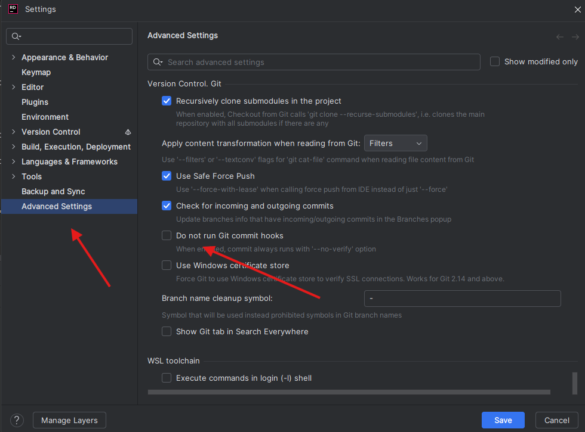

# Installing TruffleHog Locally and Creating a Git Pre-Commit Hook

## Introduction

TruffleHog is an open-source security tool that scans code repositories to detect sensitive information, such as API keys, passwords, and private keys, which may have been accidentally committed to version control.  

This script automates the setup of a global pre-commit hook to automatically scan your code, using Trufflehog, for potential secrets *before* every commit.

## Installation

Run this helper script in any bash shell (Windows/Linux/Mac). 

```bash
curl -sSL https://raw.githubusercontent.com/AmedeoV/trufflehog-pre-commit-hook/refs/heads/main/truffleHog-local-git-pre-hook.sh | bash
```


## Testing the Setup

This section outlines how to verify that TruffleHog has been correctly installed and that the global pre-commit hook is actively checking your commits.

### Verify TruffleHog is Running

To confirm that the pre-commit hook is active and TruffleHog is being invoked, make a simple, non-sensitive commit to any of your Git repositories and you should observe a log message in your terminal indicating that `"trufflehog scanning repo" or similar output from TruffleHog, followed by a successful commit message. This confirms the hook is executing.

### Test Pre-Commit Hook Blocking

To verify that TruffleHog successfully blocks commits containing hardcoded secrets, add a fake hardcoded password or API key, for example:

```
password="fakePassword123"
```

Attempt to commit the change. TruffleHog should detect the fake secret, and the pre-commit hook will block the commit. You will see an error message similar to:

```
Found unverified result ❓
Detector Type: CustomRegex
Decoder Type: PLAIN
Raw result: password="fakePassword123"
Name: Hardcoded Password
Commit: Staged
```

This confirms that the pre-commit hook is effectively preventing secrets from being committed. Remember to remove the fake password/key after testing.

### Bypassing the Pre-Commit Hook

In cases where TruffleHog might flag a false positive, or if you explicitly need to bypass the pre-commit hook for a specific commit, you can use the `--no-verify` option with your `git commit` command.

```
git commit -m "Commit message" --no-verify
```

Using this option will skip all pre-commit hooks, allowing the commit to proceed even if secrets are detected. Use this option with caution and only when you are certain that the changes do not contain actual sensitive information.

**For Rider Users:**

If you are using JetBrains Rider to commit your code and wish to bypass Git commit hooks, you will need to configure this within Rider's settings:

1.  Go to `File` > `Settings` (or `Rider` > `Preferences` on macOS).

2.  Scroll down to the bottom of the `Advanced Settings` pane.

3.  You will find an option titled "Do not run Git commit hooks" (or similar). Check this box to disable hooks for your commits made through Rider.



## Script Design Choices

This section provides more insight into the design decisions made for the TruffleHog pre-commit hook script.

### Handling Unverified/Unknown Issues

The pre-commit hook is configured to **fail the commit even for unverified or unknown issues** detected by TruffleHog. This decision was made to ensure a high level of security by adopting a "fail-safe" approach. The intent is to empower the committer to explicitly review any potential findings, regardless of their verification status, and decide whether it is a legitimate secret or a false positive that needs to be addressed. This prevents potentially sensitive information from being committed without explicit human review.

### Custom Detectors for Hardcoded Passwords

The script includes **custom detectors** specifically designed to flag scenarios that might not always be caught by TruffleHog's default configuration. For instance, a connection string containing a password might not trigger a default alert.

### Extensibility for Future Scenarios

The framework for custom detectors is designed to be extensible. As new types of sensitive information or specific hardcoding patterns become relevant, **additional custom detectors can be easily integrated** into the script. This ensures the pre-commit hook can adapt and evolve to cover a broader range of potential secret leakage scenarios in the future.
